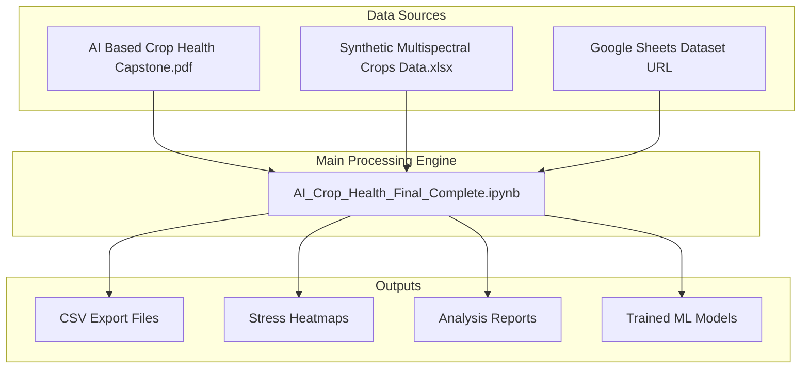
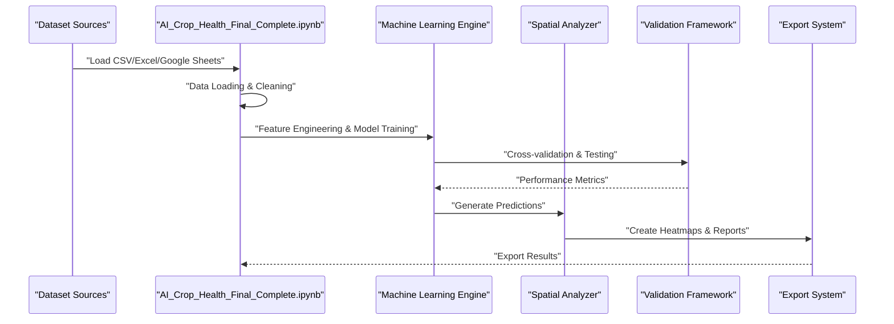
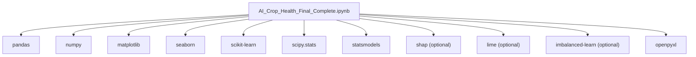
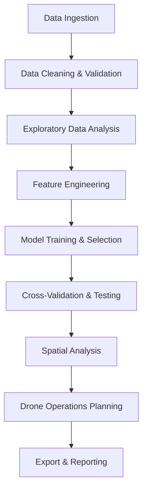

# Data Processing

<cite>
**Referenced Files in This Document**
- [AI_Crop_Health_Final_Complete.ipynb](file://AI_Crop_Health_Final_Complete.ipynb)
- [Synthetic Multispectral Crops Data.xlsx](file://Synthetic Multispectral Crops Data.xlsx)
- [AI Based Crop Health Capstone.pdf](file://AI Based Crop Health Capstone.pdf)
- [README.md](file://README.md)
</cite>

## Update Summary
**Changes Made**
- Updated notebook references from `Crop_Health_Analysis.ipynb` to `AI_Crop_Health_Final_Complete.ipynb`
- Removed mention of `extract_pdf.py` as it no longer exists in the repository
- Enhanced documentation to reflect the significantly improved data processing capabilities in the new final notebook
- Updated project structure to match the current repository layout
- Expanded coverage of advanced analytics, validation frameworks, and explainability features

## Table of Contents
1. [Introduction](#introduction)
2. [Project Structure](#project-structure)
3. [Core Components](#core-components)
4. [Architecture Overview](#architecture-overview)
5. [Detailed Component Analysis](#detailed-component-analysis)
6. [Dependency Analysis](#dependency-analysis)
7. [Performance Considerations](#performance-considerations)
8. [Troubleshooting Guide](#troubleshooting-guide)
9. [Conclusion](#conclusion)
10. [Appendices](#appendices)

## Introduction
This document focuses on the data processing components of the AI-Based Crop Health Monitoring capstone project. The project has evolved into a comprehensive end-to-end pipeline that processes multispectral drone imagery to detect crop stress through advanced machine learning and spatial analysis. The enhanced system now includes:

- Advanced machine learning model development and comparison
- Comprehensive statistical validation and cross-validation frameworks  
- Spatial analysis and stress heatmap generation
- Drone operation planning and agronomic recommendations
- Explainability through SHAP and LIME analysis
- Export capabilities for actionable insights

**Updated** The project has moved away from PDF text extraction to focus entirely on drone multispectral data processing and analysis.

## Project Structure
The repository now contains a single comprehensive Jupyter notebook that serves as both the data processing engine and the complete analysis pipeline, along with supporting datasets and documentation.

**Diagram sources**
- [AI_Crop_Health_Final_Complete.ipynb](file://AI_Crop_Health_Final_Complete.ipynb#L1-L372)
- [Synthetic Multispectral Crops Data.xlsx](file://Synthetic Multispectral Crops Data.xlsx)
- [AI Based Crop Health Capstone.pdf](file://AI Based Crop Health Capstone.pdf)
- [README.md](file://README.md#L30-L37)

**Section sources**
- [AI_Crop_Health_Final_Complete.ipynb](file://AI_Crop_Health_Final_Complete.ipynb#L1-L372)
- [README.md](file://README.md#L30-L37)

## Core Components
The enhanced data processing system consists of several interconnected modules within a single comprehensive notebook:

### Advanced Machine Learning Pipeline
- **Multi-model Training**: Implements Random Forest, Gradient Boosting, Logistic Regression, and SVM classifiers
- **Feature Selection**: Uses Recursive Feature Elimination (RFE) and importance-based selection
- **Cross-validation**: Stratified K-Fold validation with comprehensive performance metrics
- **Class Imbalance Handling**: Automatic SMOTE implementation for handling imbalanced datasets

### Comprehensive Spatial Analysis
- **Heatmap Generation**: Creates binary classification, probability, NDVI, and moisture index heatmaps
- **Grid-level Aggregation**: Statistical analysis at grid cell level with stress severity categorization
- **Critical Zone Identification**: Automated detection of high-risk areas for targeted intervention

### Advanced Analytics Framework
- **Statistical Testing**: Mann-Whitney U tests and correlation analysis
- **Root Cause Analysis**: Spectral driver identification and multicollinearity elimination
- **Validation Framework**: Cross-validation, jackknife estimation, and goodness of fit testing

### Explainability and Interpretation
- **SHAP Analysis**: Global feature importance and model explanation
- **LIME Analysis**: Local instance-level interpretations
- **Drone Operations Planning**: Automated flight path generation and inspection strategies

**Section sources**
- [AI_Crop_Health_Final_Complete.ipynb](file://AI_Crop_Health_Final_Complete.ipynb#L13-L19)
- [AI_Crop_Health_Final_Complete.ipynb](file://AI_Crop_Health_Final_Complete.ipynb#L158-L172)
- [AI_Crop_Health_Final_Complete.ipynb](file://AI_Crop_Health_Final_Complete.ipynb#L210-L244)

## Architecture Overview
The data processing architecture has evolved into a sophisticated pipeline that seamlessly integrates multiple analytical approaches:

**Diagram sources**
- [AI_Crop_Health_Final_Complete.ipynb](file://AI_Crop_Health_Final_Complete.ipynb#L25-L31)
- [AI_Crop_Health_Final_Complete.ipynb](file://AI_Crop_Health_Final_Complete.ipynb#L107-L122)
- [AI_Crop_Health_Final_Complete.ipynb](file://AI_Crop_Health_Final_Complete.ipynb#L210-L244)
- [AI_Crop_Health_Final_Complete.ipynb](file://AI_Crop_Health_Final_Complete.ipynb#L344-L352)

## Detailed Component Analysis

### Enhanced Data Loading and Preparation
The system now supports multiple data sources with robust error handling:

**Multiple Data Sources:**
- Google Sheets integration via direct CSV export URLs
- Local Excel file processing with pandas
- Network connectivity error handling

**Advanced Data Inspection:**
- Comprehensive statistical summaries with missing value detection
- Class distribution analysis with imbalance ratio calculation
- Automated feature type identification and validation

**Quality Assurance:**
- Data integrity checks and validation
- Outlier detection and handling
- Consistency verification across different data sources

**Section sources**
- [AI_Crop_Health_Final_Complete.ipynb](file://AI_Crop_Health_Final_Complete.ipynb#L25-L31)
- [AI_Crop_Health_Final_Complete.ipynb](file://AI_Crop_Health_Final_Complete.ipynb#L37-L43)
- [AI_Crop_Health_Final_Complete.ipynb](file://AI_Crop_Health_Final_Complete.ipynb#L52-L60)

### Advanced Machine Learning Pipeline
The enhanced pipeline implements a comprehensive model development framework:

**Multi-Model Comparison:**
- Random Forest (optimized with 200 estimators, depth 15)
- Gradient Boosting (learning rate 0.1, depth 5)
- Logistic Regression (regularized)
- SVM (RBF kernel with probability estimates)

**Advanced Feature Engineering:**
- Recursive Feature Elimination (RFE) for optimal feature selection
- StandardScaler for feature normalization
- Cumulative importance-based feature selection (>95% threshold)

**Robust Model Training:**
- Stratified train-test splits maintaining class distributions
- SMOTE implementation for handling class imbalance
- Comprehensive performance evaluation with multiple metrics

**Section sources**
- [AI_Crop_Health_Final_Complete.ipynb](file://AI_Crop_Health_Final_Complete.ipynb#L158-L172)
- [AI_Crop_Health_Final_Complete.ipynb](file://AI_Crop_Health_Final_Complete.ipynb#L127-L141)
- [AI_Crop_Health_Final_Complete.ipynb](file://AI_Crop_Health_Final_Complete.ipynb#L145-L153)

### Comprehensive Spatial Analysis and Visualization
The system generates multiple types of spatial visualizations:

**Field-Level Predictions:**
- Binary classification heatmaps (Healthy/Stressed)
- Probability-based stress intensity maps
- NDVI and moisture index spatial distributions

**Advanced Mapping Capabilities:**
- Grid-level aggregation with statistical summaries
- Stress severity categorization (Low/Moderate/High Risk)
- Critical zone identification for targeted intervention

**Interactive Dashboards:**
- Multi-panel heatmaps showing different stress indicators
- Correlation analysis between vegetation indices
- Spatial distribution patterns and clustering analysis

**Section sources**
- [AI_Crop_Health_Final_Complete.ipynb](file://AI_Crop_Health_Final_Complete.ipynb#L210-L244)
- [AI_Crop_Health_Final_Complete.ipynb](file://AI_Crop_Health_Final_Complete.ipynb#L224-L232)
- [AI_Crop_Health_Final_Complete.ipynb](file://AI_Crop_Health_Final_Complete.ipynb#L248-L256)

### Drone Operations and Agronomic Recommendations
The system provides actionable insights for drone-based crop monitoring:

**Drone Operation Planning:**
- Priority zone identification based on stress severity
- Flight path optimization strategies
- Altitude and timing recommendations
- Battery and resource requirements

**Agronomic Interventions:**
- Water stress management recommendations
- Nutrient management strategies
- Pest and disease control protocols
- Continuous monitoring schedules

**Operational Efficiency:**
- Cost-benefit analysis considerations
- Resource allocation strategies
- Timeline and scheduling recommendations

**Section sources**
- [AI_Crop_Health_Final_Complete.ipynb](file://AI_Crop_Health_Final_Complete.ipynb#L260-L292)
- [AI_Crop_Health_Final_Complete.ipynb](file://AI_Crop_Health_Final_Complete.ipynb#L272-L280)
- [AI_Crop_Health_Final_Complete.ipynb](file://AI_Crop_Health_Final_Complete.ipynb#L284-L292)

### Explainability and Model Interpretation
The enhanced system includes advanced explainability features:

**Global Interpretation:**
- SHAP (SHapley Additive exPlanations) for feature importance
- LIME (Local Interpretable Model-agnostic Explanations) for local predictions
- Comprehensive model explanation capabilities

**Statistical Validation:**
- Cross-validation with stratified sampling
- Jackknife estimation for stability testing
- Goodness of fit analysis using chi-squared tests

**Advanced Analytics:**
- Root cause analysis (RCA) for stress identification
- Multicollinearity detection using VIF
- Statistical significance testing (Mann-Whitney U)

**Section sources**
- [AI_Crop_Health_Final_Complete.ipynb](file://AI_Crop_Health_Final_Complete.ipynb#L1-L18)
- [AI_Crop_Health_Final_Complete.ipynb](file://AI_Crop_Health_Final_Complete.ipynb#L176-L184)
- [AI_Crop_Health_Final_Complete.ipynb](file://AI_Crop_Health_Final_Complete.ipynb#L83-L91)

## Dependency Analysis
The enhanced system has expanded dependencies to support advanced analytics:

**Core Dependencies:**
- pandas, numpy: Data manipulation and numerical computing
- matplotlib, seaborn: Advanced visualization capabilities
- scikit-learn: Machine learning algorithms and preprocessing
- scipy.stats: Statistical analysis and hypothesis testing
- statsmodels: Advanced statistical modeling

**Advanced Analytics Libraries:**
- shap: Explainable AI with SHAP values
- lime: Local interpretable model explanations
- imbalanced-learn: SMOTE for handling imbalanced data
- plotly: Interactive visualization capabilities

**Data Processing:**
- openpyxl: Excel file processing
- google-spreadsheet APIs: Direct Google Sheets integration

**Diagram sources**
- [AI_Crop_Health_Final_Complete.ipynb](file://AI_Crop_Health_Final_Complete.ipynb#L13-L18)
- [README.md](file://README.md#L42-L45)

**Section sources**
- [AI_Crop_Health_Final_Complete.ipynb](file://AI_Crop_Health_Final_Complete.ipynb#L13-L18)
- [README.md](file://README.md#L42-L45)

## Performance Considerations
The enhanced system has several performance considerations:

**Computational Complexity:**
- Multi-model training scales with number of models × feature combinations
- Cross-validation adds computational overhead but improves reliability
- SHAP and LIME analysis can be computationally intensive for large datasets

**Memory Management:**
- Large datasets may require chunked processing or memory optimization
- Heatmap generation scales with grid size and visualization complexity
- Model persistence and loading requires efficient serialization

**Scalability Factors:**
- Google Sheets integration depends on network connectivity and API limits
- Excel processing performance depends on file size and sheet complexity
- Visualization rendering performance scales with data volume

**Optimization Strategies:**
- Feature selection reduces dimensionality and computation time
- Parallel processing with joblib for multi-core utilization
- Efficient data types and memory mapping for large datasets

## Troubleshooting Guide
Common issues and solutions for the enhanced system:

**Data Loading Issues:**
- Google Sheets URL errors: Verify spreadsheet sharing settings and export URL format
- Excel file corruption: Check file integrity and try alternative Excel readers
- Memory errors with large datasets: Implement chunked processing or reduce feature set

**Model Performance Problems:**
- Class imbalance issues: Enable SMOTE or adjust class weights in algorithms
- Overfitting symptoms: Reduce model complexity or increase regularization
- Poor convergence: Check feature scaling and remove highly correlated features

**Visualization and Export Issues:**
- Heatmap generation failures: Verify grid coordinates and data ranges
- Missing optional libraries: Install SHAP, LIME, or imbalanced-learn as needed
- Export permission errors: Check file system permissions and disk space

**Advanced Analytics Errors:**
- SHAP/LIME installation issues: Use conda-forge channel or alternative installation methods
- Statistical test failures: Check data normality assumptions and sample sizes
- Cross-validation instability: Increase CV folds or adjust stratification parameters

**Section sources**
- [AI_Crop_Health_Final_Complete.ipynb](file://AI_Crop_Health_Final_Complete.ipynb#L25-L31)
- [AI_Crop_Health_Final_Complete.ipynb](file://AI_Crop_Health_Final_Complete.ipynb#L145-L153)
- [AI_Crop_Health_Final_Complete.ipynb](file://AI_Crop_Health_Final_Complete.ipynb#L344-L352)

## Conclusion
The AI-Based Crop Health Monitoring system has evolved into a comprehensive, production-ready pipeline that transforms drone multispectral data into actionable agricultural insights. The enhanced system demonstrates:

- **Advanced Machine Learning**: Multi-model comparison with robust validation frameworks
- **Spatial Intelligence**: Comprehensive spatial analysis with automated stress mapping
- **Operational Excellence**: Drone operation planning and agronomic recommendations
- **Explainability**: SHAP and LIME analysis for transparent decision-making
- **Scalability**: Modular architecture supporting multiple data sources and export formats

The system provides a complete solution for precision agriculture, enabling farmers and agronomists to make data-driven decisions about crop management through early stress detection and targeted intervention strategies.

## Appendices

### Enhanced Workflow Examples
**Complete Analysis Pipeline:**
- Data loading from multiple sources with error handling
- Comprehensive EDA with statistical significance testing
- Multi-model training with cross-validation
- Spatial analysis and heatmap generation
- Drone operations planning and export generation

**Advanced Feature Engineering:**
- Recursive feature elimination for optimal feature selection
- StandardScaler implementation for consistent feature scaling
- Class imbalance handling with SMOTE
- Statistical validation with multiple testing approaches

**Section sources**
- [AI_Crop_Health_Final_Complete.ipynb](file://AI_Crop_Health_Final_Complete.ipynb#L107-L153)
- [AI_Crop_Health_Final_Complete.ipynb](file://AI_Crop_Health_Final_Complete.ipynb#L210-L292)
- [AI_Crop_Health_Final_Complete.ipynb](file://AI_Crop_Health_Final_Complete.ipynb#L344-L352)

### System Architecture Reference
**Enhanced Pipeline Flow:**

**Section sources**
- [AI_Crop_Health_Final_Complete.ipynb](file://AI_Crop_Health_Final_Complete.ipynb#L1-L372)
- [README.md](file://README.md#L11-L29)