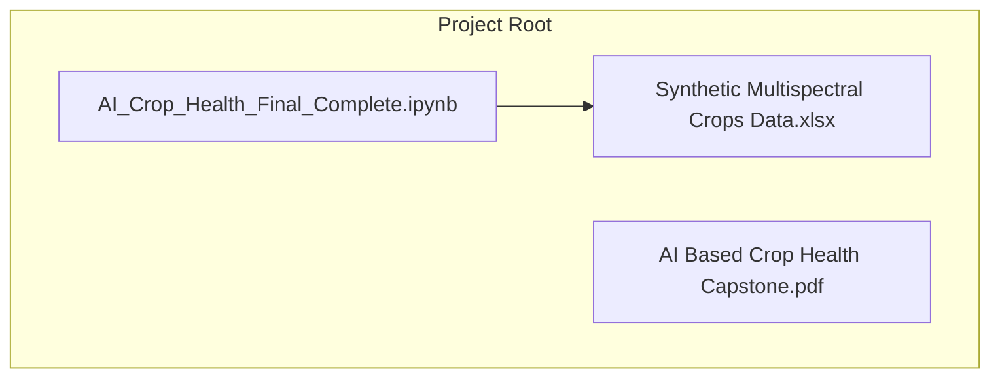

# Getting Started

<cite>
**Referenced Files in This Document**
- [AI_Crop_Health_Final_Complete.ipynb](file://AI_Crop_Health_Final_Complete.ipynb)
- [README.md](file://README.md)
</cite>

## Table of Contents
1. [Introduction](#introduction)
2. [Prerequisites](#prerequisites)
3. [Installation Instructions](#installation-instructions)
4. [Project Setup and Dataset Preparation](#project-setup-and-dataset-preparation)
5. [Running the Analysis Workflow](#running-the-analysis-workflow)
6. [Project Structure and Dependencies](#project-structure-and-dependencies)
7. [Verification Steps](#verification-steps)
8. [Troubleshooting Guide](#troubleshooting-guide)
9. [Conclusion](#conclusion)

## Introduction
This guide helps you set up and run the AI-based crop health monitoring project. The project uses machine learning to analyze multispectral crop data and generate spatial heatmaps identifying stressed areas in fields. It includes a comprehensive Jupyter notebook workflow that covers data analysis, machine learning model development, and spatial visualization.

## Prerequisites
Before starting, ensure you have:
- Python 3.x installed on your system
- A working Jupyter notebook environment (JupyterLab or classic Jupyter Notebook)
- Administrative rights to install packages in your Python environment

Key Python libraries required:
- pandas
- numpy
- scikit-learn
- matplotlib
- seaborn
- openpyxl (for Excel file handling)
- shap (for model explainability)
- lime (for local instance explanations)
- statsmodels (for statistical analysis)

These libraries are used throughout the comprehensive analysis workflow in the notebook.

**Section sources**
- [README.md](file://README.md#L41-L45)
- [AI_Crop_Health_Final_Complete.ipynb](file://AI_Crop_Health_Final_Complete.ipynb#L14-L30)

## Installation Instructions
Install all required dependencies using pip. Run these commands in your terminal or command prompt:

- Install pandas: `pip install pandas`
- Install numpy: `pip install numpy`
- Install scikit-learn: `pip install scikit-learn`
- Install matplotlib: `pip install matplotlib`
- Install seaborn: `pip install seaborn`
- Install openpyxl: `pip install openpyxl`
- Install shap: `pip install shap`
- Install lime: `pip install lime`
- Install statsmodels: `pip install statsmodels`

Notes:
- These commands install the latest compatible versions of each library.
- If you encounter permission errors, use your system's package manager with administrative privileges or install in a virtual environment.
- For Jupyter environments, ensure the kernel has access to these packages.

**Section sources**
- [README.md](file://README.md#L41-L45)
- [AI_Crop_Health_Final_Complete.ipynb](file://AI_Crop_Health_Final_Complete.ipynb#L14-L30)

## Project Setup and Dataset Preparation
Follow these steps to prepare your environment:

1. Create a dedicated project folder and place the following files inside:
   - `AI_Crop_Health_Final_Complete.ipynb` (Main analysis notebook)
   - `Synthetic Multispectral Crops Data.xlsx` (Input dataset)
   - `AI Based Crop Health Capstone.pdf` (Project specification)

2. Verify file locations:
   - The notebook expects the Excel dataset to be named exactly as referenced in the notebook.
   - The notebook automatically downloads the dataset from Google Sheets if the local file is not found.

3. Launch Jupyter:
   - Open a terminal in your project folder.
   - Start Jupyter Notebook or JupyterLab.
   - Open `AI_Crop_Health_Final_Complete.ipynb` to run the full workflow.

**Section sources**
- [README.md](file://README.md#L30-L37)
- [AI_Crop_Health_Final_Complete.ipynb](file://AI_Crop_Health_Final_Complete.ipynb#L25-L31)

## Running the Analysis Workflow
Execute the analysis workflow by running all cells in the notebook sequentially:

1. Open `AI_Crop_Health_Final_Complete.ipynb` in Jupyter.
2. Execute cells in order from top to bottom:
   - Cell 1: Project overview and objectives
   - Cell 2: Environment setup and library imports
   - Cell 3: Data loading and initial inspection
   - Cell 4: Exploratory Data Analysis (EDA) including statistical tests
   - Cell 5: Correlation analysis and spatial pattern analysis
   - Cell 6: Machine learning model development and comparison
   - Cell 7: Model evaluation and cross-validation
   - Cell 8: Spatial analysis and heatmap generation
   - Cell 9: Drone operation recommendations and agronomic insights
   - Cell 10: Project summary and future improvements

Expected outputs include:
- Comprehensive dataset analysis with missing value summaries
- EDA plots including violin plots and correlation heatmaps
- Model training and evaluation metrics across multiple algorithms
- Feature importance visualization
- Spatial heatmaps of predicted crop health
- Drone operation recommendations
- Exported CSV files with predictions and critical zones

**Section sources**
- [AI_Crop_Health_Final_Complete.ipynb](file://AI_Crop_Health_Final_Complete.ipynb#L14-L30)
- [AI_Crop_Health_Final_Complete.ipynb](file://AI_Crop_Health_Final_Complete.ipynb#L37-L71)
- [AI_Crop_Health_Final_Complete.ipynb](file://AI_Crop_Health_Final_Complete.ipynb#L107-L172)
- [AI_Crop_Health_Final_Complete.ipynb](file://AI_Crop_Health_Final_Complete.ipynb#L210-L244)

## Project Structure and Dependencies
The project consists of a single comprehensive Jupyter notebook that contains the entire analysis pipeline:

- **AI_Crop_Health_Final_Complete.ipynb**: Complete analysis pipeline including data loading, EDA, modeling, spatial visualization, and drone operation recommendations.
- **Synthetic Multispectral Crops Data.xlsx**: Input dataset containing 1200 spatial observations with 13 vegetation index features plus spatial coordinates.
- **AI Based Crop Health Capstone.pdf**: Project specification and requirements.

File dependencies:
- The notebook imports pandas, numpy, matplotlib, seaborn, scikit-learn, and additional specialized libraries for statistical analysis, model explainability, and spatial visualization.

**Diagram sources**
- [README.md](file://README.md#L30-L37)
- [AI_Crop_Health_Final_Complete.ipynb](file://AI_Crop_Health_Final_Complete.ipynb#L14-L30)

**Section sources**
- [README.md](file://README.md#L30-L37)
- [AI_Crop_Health_Final_Complete.ipynb](file://AI_Crop_Health_Final_Complete.ipynb#L14-L30)

## Verification Steps
After installation, verify your setup:

1. Test Python imports:
   - Open a Python interpreter or a new notebook cell.
   - Import each required library: pandas, numpy, scikit-learn, matplotlib, seaborn, openpyxl, shap, lime, statsmodels.
   - Confirm no import errors occur.

2. Run the notebook:
   - Execute the data loading cell to confirm the dataset loads without errors.
   - Ensure plots render correctly during EDA, modeling, and spatial analysis steps.
   - Verify that the notebook can download the dataset from Google Sheets if the local file is not present.

3. Environment checks:
   - Confirm your Jupyter kernel recognizes all installed packages.
   - If using a virtual environment, activate it before launching Jupyter.

**Section sources**
- [README.md](file://README.md#L41-L45)
- [AI_Crop_Health_Final_Complete.ipynb](file://AI_Crop_Health_Final_Complete.ipynb#L14-L30)

## Troubleshooting Guide
Common setup issues and solutions:

Issue: Permission denied during pip install
- Solution: Use administrative privileges or install in a virtual environment. Avoid installing system-wide unless necessary.

Issue: Jupyter cannot find installed packages
- Solution: Ensure the Jupyter kernel is installed in the same environment where you installed dependencies. Restart Jupyter after installing new packages.

Issue: Missing dataset file
- Solution: The notebook automatically attempts to download the dataset from Google Sheets if the local Excel file is not found. Ensure you have internet connectivity for automatic download.

Issue: Matplotlib rendering issues
- Solution: Install or upgrade matplotlib and ensure your Jupyter environment supports inline plotting.

Issue: Notebook crashes during model training
- Solution: Check for sufficient memory and ensure the dataset is properly loaded. The notebook includes error handling for missing files and network connectivity issues.

Issue: Optional libraries not available
- Solution: The notebook gracefully handles missing optional libraries like SHAP, LIME, and Plotly by providing fallback visualizations and skipping advanced explainability features.

**Section sources**
- [AI_Crop_Health_Final_Complete.ipynb](file://AI_Crop_Health_Final_Complete.ipynb#L25-L31)
- [AI_Crop_Health_Final_Complete.ipynb](file://AI_Crop_Health_Final_Complete.ipynb#L14-L30)

## Conclusion
You now have the essentials to set up and run the AI-based crop health monitoring project. Use the comprehensive Jupyter notebook to execute the full analysis workflow, which includes data exploration, machine learning model development, spatial analysis, and actionable recommendations for drone operations. The notebook is designed to handle missing datasets by automatically downloading from Google Sheets and provides graceful fallbacks for optional visualization libraries. If you encounter issues, refer to the troubleshooting section and verification steps to resolve them efficiently.