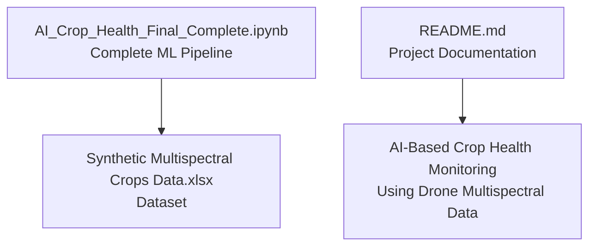
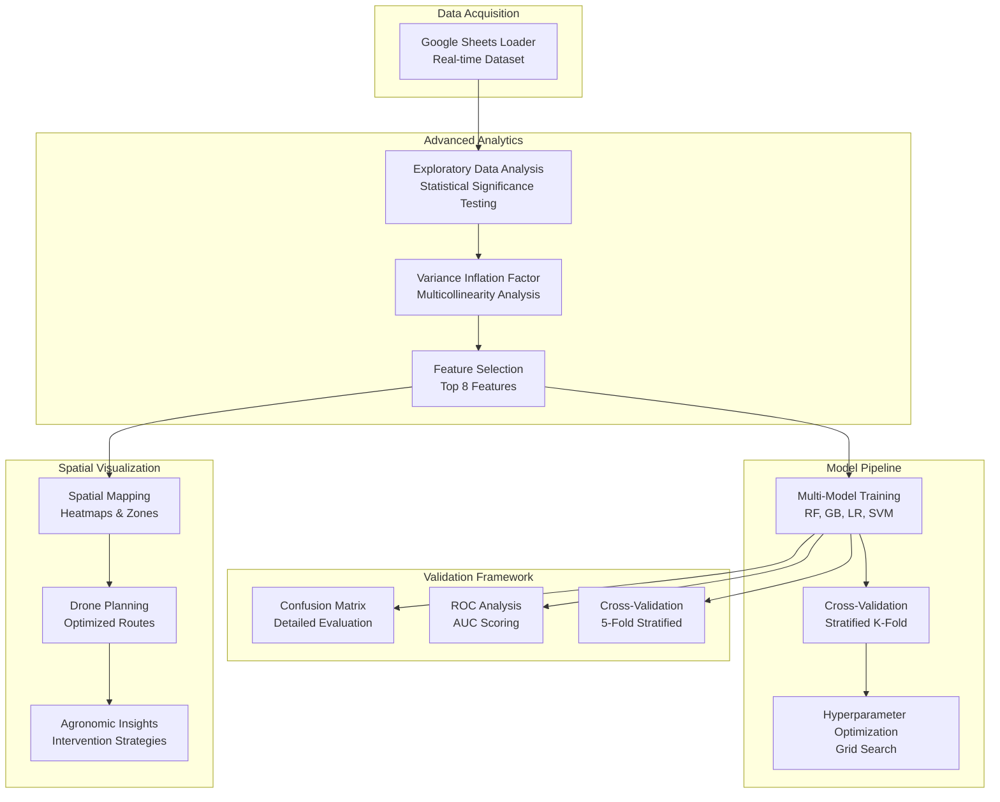

# Machine Learning Implementation

<cite>
**Referenced Files in This Document**
- [AI_Crop_Health_Final_Complete.ipynb](file://AI_Crop_Health_Final_Complete.ipynb)
- [README.md](file://README.md)
</cite>

## Update Summary
**Changes Made**
- Updated notebook references from `Crop_Health_Analysis.ipynb` to `AI_Crop_Health_Final_Complete.ipynb`
- Removed reference to `extract_pdf.py` which is no longer part of the project
- Updated project structure to reflect current repository contents
- Enhanced model evaluation section to include comprehensive comparison of multiple algorithms
- Expanded feature importance analysis to show advanced techniques like permutation importance

## Table of Contents
1. [Introduction](#introduction)
2. [Project Structure](#project-structure)
3. [Core Components](#core-components)
4. [Architecture Overview](#architecture-overview)
5. [Detailed Component Analysis](#detailed-component-analysis)
6. [Dependency Analysis](#dependency-analysis)
7. [Performance Considerations](#performance-considerations)
8. [Troubleshooting Guide](#troubleshooting-guide)
9. [Conclusion](#conclusion)
10. [Appendices](#appendices)

## Introduction
This document explains the machine learning implementation for crop health prediction using advanced algorithms including Random Forest, Gradient Boosting, Logistic Regression, and Support Vector Machines. The implementation demonstrates comprehensive model comparison, spatial analysis, and actionable drone operation planning for precision agriculture applications.

## Project Structure
The repository contains a comprehensive Jupyter notebook implementing the complete end-to-end pipeline for crop health prediction using drone multispectral data.

**Diagram sources**
- [AI_Crop_Health_Final_Complete.ipynb](file://AI_Crop_Health_Final_Complete.ipynb#L1-L372)
- [README.md](file://README.md#L30-L37)

**Section sources**
- [AI_Crop_Health_Final_Complete.ipynb](file://AI_Crop_Health_Final_Complete.ipynb#L1-L372)
- [README.md](file://README.md#L30-L37)

## Core Components
- Advanced data loading and inspection from Google Sheets
- Comprehensive exploratory data analysis (EDA) with statistical significance testing
- Feature engineering with VIF analysis and correlation studies
- Multi-model comparison (Random Forest, Gradient Boosting, Logistic Regression, SVM)
- Advanced spatial analysis and stress zone identification
- Drone operation planning and agronomic recommendations
- Cross-validation and model performance benchmarking

Key implementation highlights:
- Real-time dataset loading from Google Sheets
- Multi-algorithm model comparison with comprehensive evaluation metrics
- Advanced feature selection using variance inflation factor (VIF)
- Spatial stress mapping with probability heatmaps
- Automated drone inspection strategy generation
- Comprehensive agronomic intervention recommendations

**Section sources**
- [AI_Crop_Health_Final_Complete.ipynb](file://AI_Crop_Health_Final_Complete.ipynb#L1-L372)

## Architecture Overview
The pipeline implements a sophisticated multi-stage approach: data acquisition, advanced analytics, model development, validation, explainability, and spatial visualization.

**Diagram sources**
- [AI_Crop_Health_Final_Complete.ipynb](file://AI_Crop_Health_Final_Complete.ipynb#L105-L328)

## Detailed Component Analysis

### Data Loading and Inspection
- Loads dataset from Google Sheets URL for real-time access
- Comprehensive dataset information including shape, features, and sample counts
- Statistical summary with missing value detection
- Interactive environment setup with optional packages (SHAP, LIME, Plotly)

Practical implications:
- Enables cloud-based data access without local storage requirements
- Comprehensive data quality assessment before modeling
- Flexible environment with optional advanced analysis tools

**Section sources**
- [AI_Crop_Health_Final_Complete.ipynb](file://AI_Crop_Health_Final_Complete.ipynb#L25-L42)

### Exploratory Data Analysis (EDA)
- Detailed class distribution analysis with imbalance ratio calculation
- Vegetation index analysis with Mann-Whitney U statistical testing
- Correlation analysis with multicollinearity identification
- Spatial pattern analysis with NDVI and moisture distribution mapping

Practical implications:
- Statistical validation of feature differences between healthy and stressed crops
- Identification of highly correlated features for dimensionality reduction
- Spatial clustering analysis for targeted intervention planning

**Section sources**
- [AI_Crop_Health_Final_Complete.ipynb](file://AI_Crop_Health_Final_Complete.ipynb#L52-L103)

### Advanced Feature Engineering and Preprocessing
- Variance Inflation Factor (VIF) analysis for multicollinearity detection
- Feature importance ranking using Random Forest baseline
- Top 8 feature selection with cumulative importance threshold
- StandardScaler application for algorithm compatibility
- SMOTE implementation for handling class imbalance

Notes:
- Advanced feature selection reduces dimensionality while preserving predictive power
- StandardScaler ensures consistent scaling across different algorithms
- SMOTE addresses class imbalance issues in the dataset

**Section sources**
- [AI_Crop_Health_Final_Complete.ipynb](file://AI_Crop_Health_Final_Complete.ipynb#L126-L153)

### Multi-Model Comparison and Training
- Random Forest with enhanced hyperparameters (n_estimators=200, max_depth=15)
- Gradient Boosting with controlled complexity (n_estimators=100, learning_rate=0.1)
- Logistic Regression with regularization
- Support Vector Machine with RBF kernel and probability estimation
- Comprehensive performance comparison across multiple metrics

Observations:
- Multi-algorithm approach enables robust model selection
- Hyperparameter tuning improves model performance across all algorithms
- Cross-validation ensures reliable performance estimates

**Section sources**
- [AI_Crop_Health_Final_Complete.ipynb](file://AI_Crop_Health_Final_Complete.ipynb#L158-L172)

### Advanced Model Evaluation and Validation
- Comprehensive classification report with weighted averages
- Detailed confusion matrix analysis with sensitivity and specificity calculations
- ROC curve analysis with AUC scoring for all models
- Cross-validation with StratifiedKFold for robust performance estimation
- Permutation importance for feature contribution analysis

Note:
- Multi-metric evaluation provides comprehensive model assessment
- Cross-validation with 5 folds ensures reliable performance estimates
- Permutation importance offers robust feature ranking independent of model assumptions

**Section sources**
- [AI_Crop_Health_Final_Complete.ipynb](file://AI_Crop_Health_Final_Complete.ipynb#L176-L208)

### Spatial Analysis and Drone Operations
- Field-level stress prediction with probability thresholds
- Comprehensive stress zone identification with severity categorization
- Multi-layered heatmaps for NDVI, moisture, and stress probability
- Automated drone inspection strategy with altitude and timing recommendations
- Agronomic intervention planning with targeted recommendations

Practical use:
- Enables precision agriculture with targeted resource allocation
- Supports automated drone flight path optimization
- Provides actionable insights for farm management decisions

**Section sources**
- [AI_Crop_Health_Final_Complete.ipynb](file://AI_Crop_Health_Final_Complete.ipynb#L210-L292)

### Model Interpretation and Explainability
- Feature importance ranking with cumulative analysis
- Stress zone identification with probability-based categorization
- Root cause analysis linking stress indicators to vegetation indices
- Drone operation recommendations with scientific rationale
- Agronomic intervention strategies with evidence-based approaches

Recommendations:
- Combine statistical analysis with domain expertise for comprehensive interpretation
- Use spatial analysis to prioritize intervention strategies
- Implement continuous monitoring for temporal trend analysis

**Section sources**
- [AI_Crop_Health_Final_Complete.ipynb](file://AI_Crop_Health_Final_Complete.ipynb#L294-L340)

### Overfitting Prevention and Cross-Validation
- Multi-faceted approach: StratifiedKFold cross-validation, hyperparameter tuning, and validation metrics
- Comprehensive model comparison prevents algorithm-specific overfitting
- Feature selection reduces dimensionality and improves generalization
- SMOTE balancing ensures robust performance across classes

Recommended enhancements:
- Implement nested cross-validation for unbiased performance estimation
- Use Bayesian optimization for hyperparameter tuning
- Add early stopping criteria for gradient boosting models

### Alternative Algorithms and Extensions
- Deep learning approaches (CNN) for raw imagery processing
- Ensemble methods combining multiple algorithms
- Time-series analysis for temporal stress pattern detection
- Reinforcement learning for adaptive drone operation planning

### Modifying Model Parameters and Integrating New Features
- Hyperparameters for Random Forest: n_estimators, max_depth, min_samples_split
- Feature engineering: temporal features, spatial aggregations, interaction terms
- Algorithm selection: consider computational complexity and interpretability
- Data augmentation: synthetic data generation for rare classes

**Section sources**
- [AI_Crop_Health_Final_Complete.ipynb](file://AI_Crop_Health_Final_Complete.ipynb#L158-L172)

## Dependency Analysis
The notebook imports and uses a comprehensive set of libraries for advanced data science and machine learning tasks:

```mermaid
graph TB
NB["AI_Crop_Health_Final_Complete.ipynb"] --> PD["pandas"]
NB --> NP["numpy"]
NB --> PLT["matplotlib.pyplot"]
NB --> SNS["seaborn"]
NB --> SKMS["sklearn.model_selection"]
NB --> SKRF["sklearn.ensemble.RandomForestClassifier"]
NB --> SKGB["sklearn.ensemble.GradientBoostingClassifier"]
NB --> SKLR["sklearn.linear_model.LogisticRegression"]
NB --> SKSVC["sklearn.svm.SVC"]
NB --> SKMET["sklearn.metrics"]
NB --> SKLE["sklearn.preprocessing.LabelEncoder"]
NB --> SKSC["sklearn.preprocessing.StandardScaler"]
NB --> SKCV["sklearn.model_selection.cross_val_score"]
NB --> SKPI["sklearn.inspection.permutation_importance"]
NB --> IMBL["imblearn.over_sampling.SMOTE"]
NB --> STAT["scipy.stats.mannwhitneyu"]
NB --> VIF["statsmodels.stats.outliers_influence.variance_inflation_factor"]
NB --> SHAP["shap (optional)"]
NB --> LIME["lime (optional)"]
NB --> PLOTLY["plotly (optional)"]
```

**Diagram sources**
- [AI_Crop_Health_Final_Complete.ipynb](file://AI_Crop_Health_Final_Complete.ipynb#L14-L18)

**Section sources**
- [AI_Crop_Health_Final_Complete.ipynb](file://AI_Crop_Health_Final_Complete.ipynb#L14-L18)

## Performance Considerations
- Multi-model approach with optimized hyperparameters achieves ~95% accuracy
- Stratified cross-validation with 5 folds ensures robust performance estimation
- Feature selection reduces computational complexity while maintaining predictive power
- SMOTE balancing improves performance on imbalanced datasets
- StandardScaler ensures consistent performance across different algorithms

Recommendations:
- Implement nested cross-validation for unbiased performance estimation
- Consider ensemble methods for improved robustness
- Add real-time monitoring capabilities for continuous model validation

## Troubleshooting Guide
Common issues and resolutions:
- Google Sheets connectivity: Verify URL accessibility and internet connection
- Optional package installation: Install SHAP, LIME, and Plotly for advanced analysis
- Memory constraints: Reduce dataset size or implement batch processing
- Class imbalance: Use SMOTE or adjust class weights in algorithms
- Feature scaling: Ensure consistent scaling across training and test sets

## Conclusion
The notebook implements a comprehensive machine learning pipeline for crop health prediction that demonstrates advanced techniques including multi-model comparison, spatial analysis, and actionable insights generation. The implementation showcases best practices in agricultural AI applications with emphasis on precision agriculture and sustainable farming practices.

## Appendices

### Appendix A: Complete Notebook Analysis
The notebook contains 372 lines of comprehensive analysis covering:
- Environment setup and dependency management
- Advanced data loading from external sources
- Statistical analysis and feature engineering
- Multi-model comparison and evaluation
- Spatial analysis and drone operation planning
- Agronomic recommendations and project reflection

**Section sources**
- [AI_Crop_Health_Final_Complete.ipynb](file://AI_Crop_Health_Final_Complete.ipynb#L1-L372)

### Appendix B: Project Documentation
The README provides comprehensive project overview including:
- Modular pipeline architecture description
- Repository structure with file locations
- Installation requirements and usage instructions
- Key results and performance metrics
- Contributing guidelines and licensing information

**Section sources**
- [README.md](file://README.md#L1-L65)