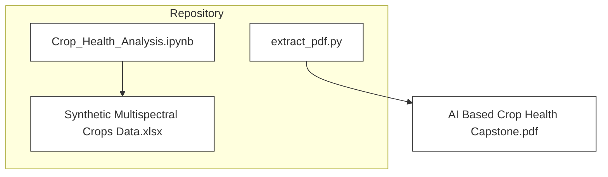
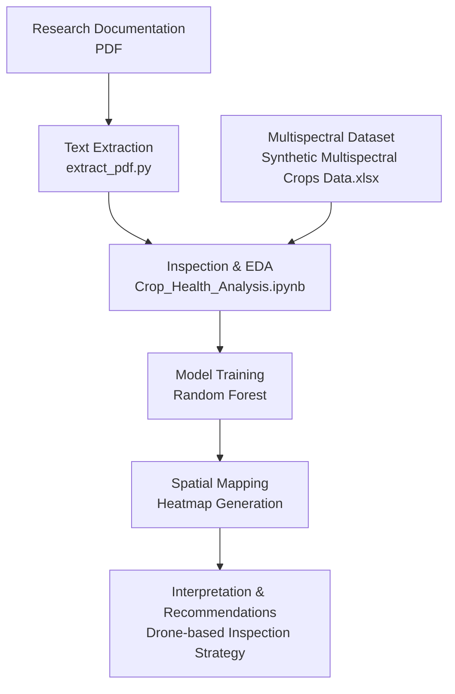
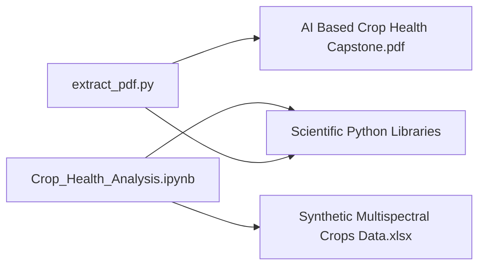

# Project Overview

<cite>
**Referenced Files in This Document**
- [Crop_Health_Analysis.ipynb](file://Crop_Health_Analysis.ipynb)
- [extract_pdf.py](file://extract_pdf.py)
</cite>

## Table of Contents
1. [Introduction](#introduction)
2. [Project Structure](#project-structure)
3. [Core Components](#core-components)
4. [Architecture Overview](#architecture-overview)
5. [Detailed Component Analysis](#detailed-component-analysis)
6. [Dependency Analysis](#dependency-analysis)
7. [Performance Considerations](#performance-considerations)
8. [Troubleshooting Guide](#troubleshooting-guide)
9. [Conclusion](#conclusion)

## Introduction
This project demonstrates a capstone implementation of AI-driven crop health monitoring using machine learning. It addresses the critical challenge of detecting crop stress early and precisely, enabling targeted interventions that reduce resource waste and maximize yield. The solution leverages multispectral imagery analysis to compute vegetation indices (notably NDVI and GNDVI) and applies a supervised classification pipeline to identify stressed regions across a field grid. The output is a spatial heatmap and actionable recommendations for drone-based inspection and monitoring.

Target audience:
- Agricultural researchers investigating precision agriculture techniques
- Precision farming professionals seeking data-driven crop health insights
- Developers building AI applications for agricultural domains

## Project Structure
The repository contains two primary artifacts:
- A Jupyter Notebook implementing the end-to-end analysis pipeline
- A Python script for extracting text from PDF documentation

**Diagram sources**
- [Crop_Health_Analysis.ipynb](file://Crop_Health_Analysis.ipynb#L1-L200)
- [extract_pdf.py](file://extract_pdf.py#L1-L14)

**Section sources**
- [Crop_Health_Analysis.ipynb](file://Crop_Health_Analysis.ipynb#L1-L200)
- [extract_pdf.py](file://extract_pdf.py#L1-L14)

## Core Components
- Multispectral data ingestion and inspection
- Exploratory data analysis (EDA) focusing on vegetation index distributions
- Feature engineering and preprocessing (label encoding, feature selection)
- Supervised classification using Random Forest
- Spatial analysis and heatmap generation
- Interpretation and drone-based recommendation workflow

Key terminology aligned with the codebase:
- Multispectral imagery
- Vegetation indices (NDVI, GNDVI)
- Drone-based monitoring
- Field grid coordinates (grid_x, grid_y)
- Crop health labels (healthy vs. stressed)

**Section sources**
- [Crop_Health_Analysis.ipynb](file://Crop_Health_Analysis.ipynb#L10-L200)

## Architecture Overview
The system follows a structured data flow from research documentation to actionable insights:

**Diagram sources**
- [extract_pdf.py](file://extract_pdf.py#L1-L14)
- [Crop_Health_Analysis.ipynb](file://Crop_Health_Analysis.ipynb#L1-L200)

## Detailed Component Analysis

### Data Loading and Inspection
Purpose:
- Load synthetic multispectral crop data
- Inspect dataset shape, missing values, and initial distributions

Key steps:
- Load dataset from Excel
- Display basic info and first rows
- Summarize missing values

Practical example:
- Use the notebook cell that loads the dataset and prints metadata to validate data integrity before proceeding.

**Section sources**
- [Crop_Health_Analysis.ipynb](file://Crop_Health_Analysis.ipynb#L30-L40)

### Exploratory Data Analysis (EDA)
Purpose:
- Understand label distributions and relationships among vegetation indices

Key steps:
- Visualize crop health label counts
- Plot correlation heatmap for numeric features

Practical example:
- Observe the distribution of healthy vs. stressed labels and note any strong correlations among vegetation indices that could inform feature importance.

**Section sources**
- [Crop_Health_Analysis.ipynb](file://Crop_Health_Analysis.ipynb#L47-L70)

### Feature Engineering and Preprocessing
Purpose:
- Encode categorical labels and prepare features for modeling

Key steps:
- Encode crop health labels
- Select features excluding spatial coordinates and raw labels
- Split dataset into training and testing sets

Practical example:
- Confirm that grid_x and grid_y are excluded from modeling features and that stratified sampling preserves label distribution.

**Section sources**
- [Crop_Health_Analysis.ipynb](file://Crop_Health_Analysis.ipynb#L77-L101)

### Machine Learning Model Development
Purpose:
- Train a Random Forest classifier to predict crop health status

Key steps:
- Initialize and fit Random Forest model
- Generate predictions and probabilities
- Evaluate model performance and display feature importances

Practical example:
- Review the classification report and feature importance plot to understand which vegetation indices drive predictions.

**Section sources**
- [Crop_Health_Analysis.ipynb](file://Crop_Health_Analysis.ipynb#L108-L142)

### Spatial Analysis and Heatmap Generation
Purpose:
- Map predicted crop health back onto a field grid

Key steps:
- Apply trained model to the full dataset
- Pivot predictions by grid coordinates
- Render a spatial heatmap indicating healthy vs. stressed zones

Practical example:
- Use the heatmap to identify clusters of stressed areas and plan targeted drone flights over high-risk regions.

**Section sources**
- [Crop_Health_Analysis.ipynb](file://Crop_Health_Analysis.ipynb#L149-L172)

### Interpretation and Recommendations
Purpose:
- Translate model outputs into actionable recommendations for precision agriculture

Key steps:
- Summarize observations about vegetation indices and spatial hotspots
- Propose a drone inspection strategy focused on stressed zones
- Suggest temporal monitoring cadence

Practical example:
- Plan drone missions to the upper-right quadrant if it contains stressed zones, optimizing flight paths and scheduling follow-up flights every 3–5 days.

**Section sources**
- [Crop_Health_Analysis.ipynb](file://Crop_Health_Analysis.ipynb#L179-L189)

### PDF Text Extraction Utility
Purpose:
- Extract textual content from research documentation for downstream analysis

Key steps:
- Open PDF using a PDF reader
- Iterate through pages and concatenate extracted text

Practical example:
- Run the extraction script to process the project’s documentation and log the resulting text for review.

**Section sources**
- [extract_pdf.py](file://extract_pdf.py#L1-L14)

## Dependency Analysis
High-level dependencies:
- The notebook depends on the synthetic dataset for training and inference
- The extraction script depends on the presence of the PDF documentation
- Both components rely on standard scientific Python libraries (pandas, numpy, scikit-learn, matplotlib, seaborn)

**Diagram sources**
- [extract_pdf.py](file://extract_pdf.py#L1-L14)
- [Crop_Health_Analysis.ipynb](file://Crop_Health_Analysis.ipynb#L1-L200)

**Section sources**
- [extract_pdf.py](file://extract_pdf.py#L1-L14)
- [Crop_Health_Analysis.ipynb](file://Crop_Health_Analysis.ipynb#L1-L200)

## Performance Considerations
- Data quality: Ensure the synthetic dataset maintains realistic distributions for vegetation indices and spatial coordinates to support reliable model training and spatial mapping.
- Model scalability: Random Forest is robust and interpretable; consider hyperparameter tuning and cross-validation for improved generalization.
- Visualization efficiency: For large grids, optimize heatmap rendering and consider aggregating predictions to reduce memory overhead.
- Drone mission planning: Use spatial clustering to minimize flight distance and maximize coverage of stressed zones.

## Troubleshooting Guide
Common issues and resolutions:
- Missing dataset: Verify the Excel file exists and is readable; confirm column names match expectations (including vegetation indices and grid coordinates).
- Memory errors during heatmap generation: Reduce grid resolution or aggregate predictions before pivoting.
- PDF extraction failures: Confirm the PDF path is correct and accessible; ensure the PDF reader library is installed and up to date.
- Label encoding mismatches: Validate that label encoding aligns with the model’s internal class mapping and that predictions are decoded appropriately before spatial mapping.

**Section sources**
- [Crop_Health_Analysis.ipynb](file://Crop_Health_Analysis.ipynb#L30-L172)
- [extract_pdf.py](file://extract_pdf.py#L1-L14)

## Conclusion
This capstone project demonstrates a complete pipeline for AI-based crop health monitoring using multispectral imagery. By combining supervised classification with spatial analysis, it produces actionable insights suitable for precision agriculture workflows. The notebook provides a reproducible framework for researchers and practitioners to evaluate vegetation indices, train predictive models, and guide drone-based inspections for targeted interventions.