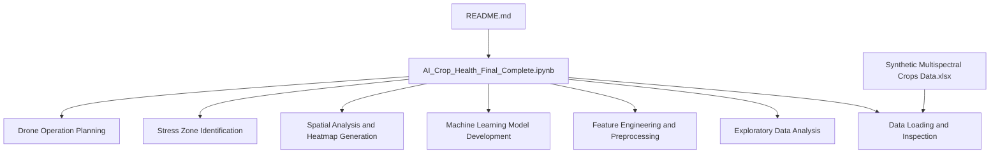
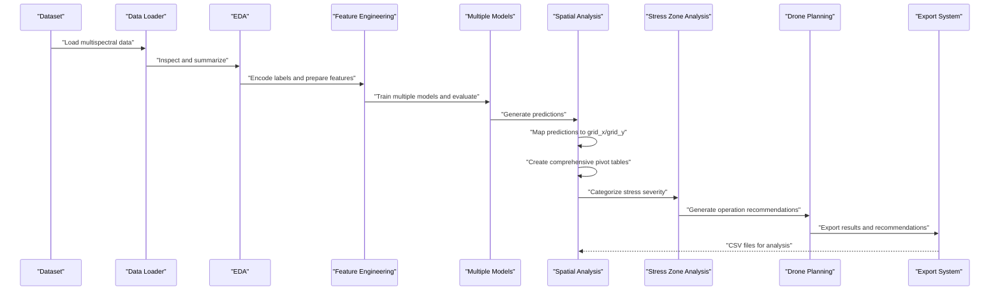
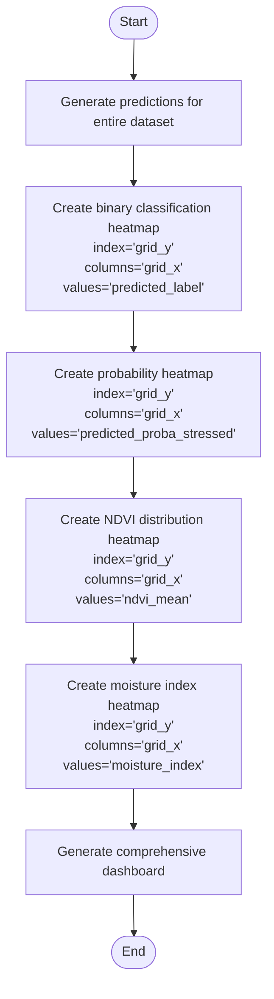
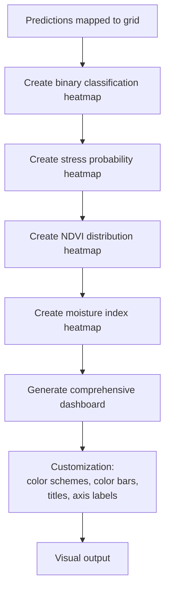
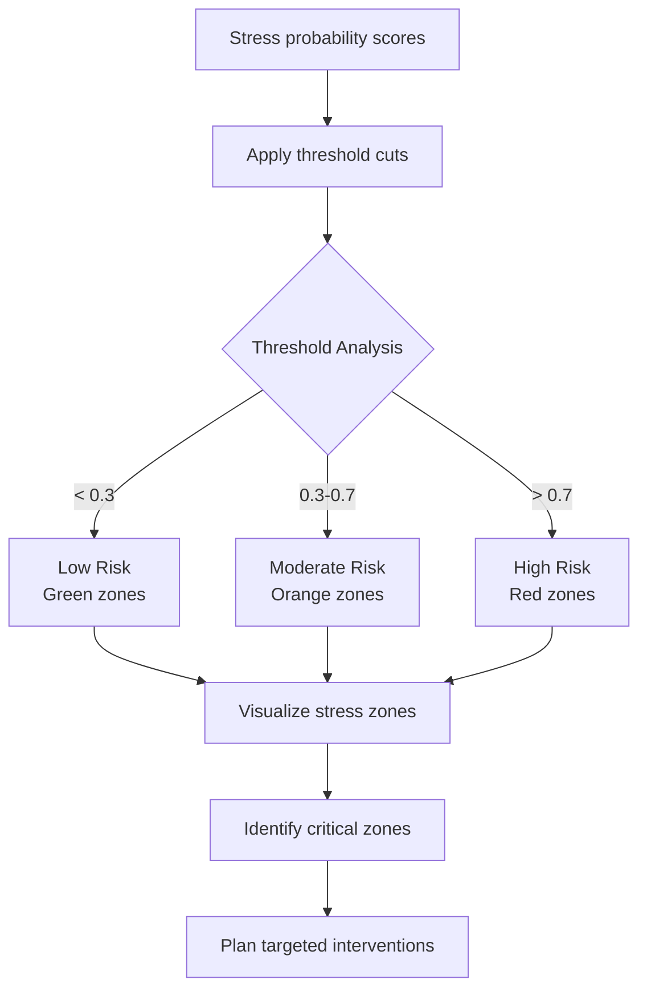
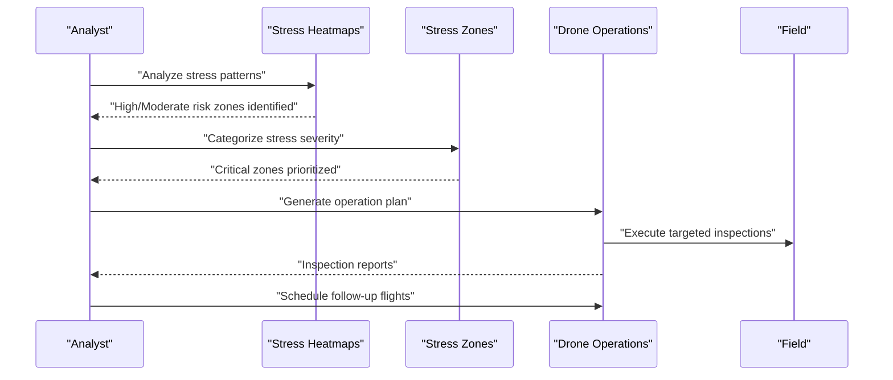
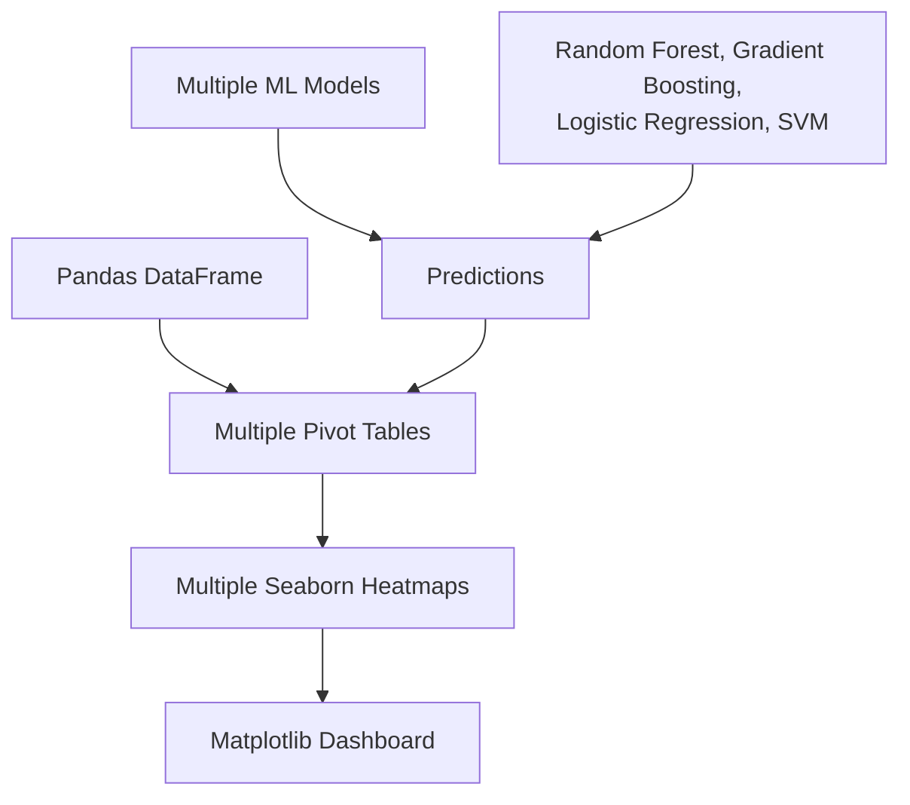

# Spatial Analysis and Visualization

<cite>
**Referenced Files in This Document**
- [AI_Crop_Health_Final_Complete.ipynb](file://AI_Crop_Health_Final_Complete.ipynb)
- [README.md](file://README.md)
</cite>

## Update Summary
**Changes Made**
- Updated notebook reference from `Crop_Health_Analysis.ipynb` to `AI_Crop_Health_Final_Complete.ipynb`
- Removed documentation for `extract_pdf.py` as it's no longer part of the repository
- Updated project structure to reflect the current repository layout
- Enhanced spatial analysis documentation based on the comprehensive notebook content

## Table of Contents
1. [Introduction](#introduction)
2. [Project Structure](#project-structure)
3. [Core Components](#core-components)
4. [Architecture Overview](#architecture-overview)
5. [Detailed Component Analysis](#detailed-component-analysis)
6. [Dependency Analysis](#dependency-analysis)
7. [Performance Considerations](#performance-considerations)
8. [Troubleshooting Guide](#troubleshooting-guide)
9. [Conclusion](#conclusion)
10. [Appendices](#appendices)

## Introduction
This document provides comprehensive documentation for the spatial analysis and visualization components of the AI-based crop health monitoring system. It focuses on:
- Coordinate mapping using grid_x and grid_y to establish spatial relationships
- Heatmap generation methodology using Seaborn with color schemes representing healthy vs. stressed vegetation
- Pivot table transformations to reshape prediction data for spatial visualization
- Spatial interpretation guidelines for identifying stress zones and planning targeted interventions
- Drone inspection strategy including flight path optimization, temporal monitoring protocols, and resource allocation
- Practical examples of heatmap creation, coordinate system interpretation, and spatial pattern recognition
- Visualization customization options, export capabilities, and integration with geographic information systems
- Guidance on scaling the analysis to larger fields and incorporating real-time drone data

**Updated** The system now uses a comprehensive Jupyter notebook pipeline that includes advanced spatial analysis, stress zone categorization, and detailed drone operation recommendations.

## Project Structure
The project consists of:
- A comprehensive Jupyter Notebook containing the complete end-to-end pipeline: data loading, exploratory data analysis, machine learning modeling, spatial analysis, and visualization
- A synthetic dataset file containing multispectral crop data with spatial coordinates
- Project specification documentation

**Diagram sources**
- [AI_Crop_Health_Final_Complete.ipynb](file://AI_Crop_Health_Final_Complete.ipynb#L1-L372)
- [README.md](file://README.md#L30-L37)

**Section sources**
- [AI_Crop_Health_Final_Complete.ipynb](file://AI_Crop_Health_Final_Complete.ipynb#L1-L372)
- [README.md](file://README.md#L30-L37)

## Core Components
- Data loading and inspection: Loads multispectral crop data and performs basic inspection and missing value checks
- Exploratory data analysis: Visualizes label distributions and correlation among numeric features
- Feature engineering and preprocessing: Encodes labels and prepares features for modeling
- Machine learning model development: Trains multiple classifiers and evaluates performance
- Spatial analysis and heatmap generation: Maps predictions back to spatial coordinates using grid_x and grid_y, and generates comprehensive spatial heatmaps
- Stress zone identification: Categorizes stress severity levels (Low, Moderate, High Risk)
- Drone operation planning: Provides actionable recommendations for targeted inspections
- Export functionality: Generates CSV files for further analysis and integration

Key implementation references:
- Data loading and inspection: [AI_Crop_Health_Final_Complete.ipynb](file://AI_Crop_Health_Final_Complete.ipynb#L23-L31)
- Exploratory data analysis: [AI_Crop_Health_Final_Complete.ipynb](file://AI_Crop_Health_Final_Complete.ipynb#L52-L91)
- Feature engineering and preprocessing: [AI_Crop_Health_Final_Complete.ipynb](file://AI_Crop_Health_Final_Complete.ipynb#L107-L141)
- Machine learning model development: [AI_Crop_Health_Final_Complete.ipynb](file://AI_Crop_Health_Final_Complete.ipynb#L158-L184)
- Spatial analysis and heatmap generation: [AI_Crop_Health_Final_Complete.ipynb](file://AI_Crop_Health_Final_Complete.ipynb#L224-L232)
- Stress zone identification: [AI_Crop_Health_Final_Complete.ipynb](file://AI_Crop_Health_Final_Complete.ipynb#L236-L244)
- Drone operation planning: [AI_Crop_Health_Final_Complete.ipynb](file://AI_Crop_Health_Final_Complete.ipynb#L272-L280)

**Section sources**
- [AI_Crop_Health_Final_Complete.ipynb](file://AI_Crop_Health_Final_Complete.ipynb#L224-L280)

## Architecture Overview
The spatial analysis and visualization pipeline follows a comprehensive workflow:
- Input data (multispectral crop data with spatial coordinates grid_x and grid_y) is loaded and inspected
- Exploratory data analysis explores label distributions and feature correlations
- Features are engineered and encoded, and the dataset is split for training and testing
- Multiple machine learning models are trained and compared
- Predictions are generated for the entire dataset and mapped back to spatial coordinates
- Comprehensive pivot table reshaping enables multiple heatmap visualizations
- Stress zones are categorized into Low, Moderate, and High Risk categories
- Drone operation recommendations are generated based on stress analysis
- Results are exported for further analysis and integration

**Diagram sources**
- [AI_Crop_Health_Final_Complete.ipynb](file://AI_Crop_Health_Final_Complete.ipynb#L224-L280)

## Detailed Component Analysis

### Spatial Analysis and Coordinate Mapping
- Purpose: Establish spatial relationships using grid_x and grid_y to map predictions back to field locations
- Methodology:
  - Predictions are generated for the entire dataset and stored as predicted_label and predicted_proba_stressed
  - Multiple pivot tables are constructed with grid_y as rows and grid_x as columns for different visualization types
  - This creates comprehensive spatial matrices suitable for multiple heatmap visualizations

**Diagram sources**
- [AI_Crop_Health_Final_Complete.ipynb](file://AI_Crop_Health_Final_Complete.ipynb#L224-L232)

**Section sources**
- [AI_Crop_Health_Final_Complete.ipynb](file://AI_Crop_Health_Final_Complete.ipynb#L224-L232)

### Heatmap Generation with Seaborn
- Color schemes: 
  - RdYlGn_r for binary classification (0=Healthy, 1=Stressed)
  - RdYlGn for NDVI values (Red=Low, Green=High)
  - Blues for moisture index (Blue=Low, Light=High)
- Data transformation: Multiple pivot table reshaping enables comprehensive spatial visualization
- Visualization customization:
  - Comprehensive dashboard with four different heatmap types
  - Color bar labels indicating health scales and measurement units
  - Axis labels reflecting grid coordinates and spatial orientation

**Diagram sources**
- [AI_Crop_Health_Final_Complete.ipynb](file://AI_Crop_Health_Final_Complete.ipynb#L224-L232)

**Section sources**
- [AI_Crop_Health_Final_Complete.ipynb](file://AI_Crop_Health_Final_Complete.ipynb#L224-L232)

### Stress Zone Identification and Categorization
- Purpose: Categorize stress severity levels for targeted intervention planning
- Methodology:
  - Stress probability thresholds: 0-0.3 (Low Risk), 0.3-0.7 (Moderate Risk), 0.7-1.0 (High Risk)
  - Color-coded visualization: Green=Low Risk, Orange=Moderate Risk, Red=High Risk
  - Statistical analysis: Distribution of stress severity levels across the field
  - Critical zone identification: Areas with stress probability > 70%

**Diagram sources**
- [AI_Crop_Health_Final_Complete.ipynb](file://AI_Crop_Health_Final_Complete.ipynb#L236-L244)

**Section sources**
- [AI_Crop_Health_Final_Complete.ipynb](file://AI_Crop_Health_Final_Complete.ipynb#L236-L244)

### Drone Inspection Strategy
- Targeted scouting: High-resolution RGB imaging for High Risk zones, multispectral monitoring for Moderate Risk zones
- Flight path optimization: Focus on high-risk clusters, progressive scanning patterns, optimal altitude selection
- Temporal monitoring: Weekly baseline scans, bi-weekly follow-ups, comparative analysis
- Resource allocation: Battery requirements, flight time estimates, daily flight capacity

**Diagram sources**
- [AI_Crop_Health_Final_Complete.ipynb](file://AI_Crop_Health_Final_Complete.ipynb#L272-L280)

**Section sources**
- [AI_Crop_Health_Final_Complete.ipynb](file://AI_Crop_Health_Final_Complete.ipynb#L272-L280)

### Practical Examples
- Comprehensive heatmap creation:
  - Steps: Generate predictions, create four different pivot tables, render Seaborn heatmaps with customized color schemes and labels
  - Reference: [AI_Crop_Health_Final_Complete.ipynb](file://AI_Crop_Health_Final_Complete.ipynb#L224-L232)
- Coordinate system interpretation:
  - Use grid_x as column index and grid_y as row index in pivot tables
  - Reference: [AI_Crop_Health_Final_Complete.ipynb](file://AI_Crop_Health_Final_Complete.ipynb#L224-L232)
- Spatial pattern recognition:
  - Observe clusters of red regions indicating High Risk stress hotspots
  - Reference: [AI_Crop_Health_Final_Complete.ipynb](file://AI_Crop_Health_Final_Complete.ipynb#L236-L244)

**Section sources**
- [AI_Crop_Health_Final_Complete.ipynb](file://AI_Crop_Health_Final_Complete.ipynb#L224-L244)

### Visualization Customization and Export
- Customization options:
  - Multiple color schemes for different visualization types
  - Comprehensive dashboard layout with four different heatmap types
  - Color bar labels with measurement units and health scales
  - Axis labels with spatial orientation and grid coordinates
- Export capabilities:
  - Export predictions to CSV for external analysis
  - Export critical zones for intervention planning
  - Export model performance metrics for comparison
- Integration with geographic information systems:
  - Use grid coordinates for spatial alignment
  - Export processed datasets for GIS platform integration
  - Maintain coordinate system for geographic mapping

**Section sources**
- [AI_Crop_Health_Final_Complete.ipynb](file://AI_Crop_Health_Final_Complete.ipynb#L344-L352)

### Scaling to Larger Fields and Real-Time Data
- Scaling considerations:
  - Increase grid resolution for higher precision mapping
  - Partition fields into manageable tiles for batch processing
  - Parallelize prediction and heatmap generation across tiles
  - Implement streaming data processing for real-time updates
- Real-time integration:
  - Stream new drone imagery into the pipeline for continuous updates
  - Automate retraining of machine learning models with recent data
  - Update heatmaps dynamically as new predictions become available
  - Implement automated alert systems for critical stress events

[No sources needed since this section provides general guidance]

## Dependency Analysis
The spatial analysis pipeline depends on:
- Pandas for data manipulation and comprehensive pivot table creation
- Seaborn for multiple heatmap visualizations with different color schemes
- Matplotlib for figure customization and comprehensive dashboard layout
- Scikit-learn for multiple machine learning model training and evaluation
- NumPy for numerical computations and statistical analysis

**Diagram sources**
- [AI_Crop_Health_Final_Complete.ipynb](file://AI_Crop_Health_Final_Complete.ipynb#L224-L232)

**Section sources**
- [AI_Crop_Health_Final_Complete.ipynb](file://AI_Crop_Health_Final_Complete.ipynb#L224-L232)

## Performance Considerations
- Data size: Large datasets may require chunked processing or tiling to manage memory usage during multiple pivot table creations
- Visualization performance: Multiple heatmaps with different color schemes may require optimization for large grids
- Model inference: Batch predictions for entire datasets to avoid repeated model calls across multiple models
- Export efficiency: Use appropriate formats and compression when saving multiple CSV files and datasets

[No sources needed since this section provides general guidance]

## Troubleshooting Guide
- Missing values: Inspect and handle missing data before pivot table creation to avoid unexpected NaN values in the heatmaps
- Coordinate alignment: Ensure grid_x and grid_y are properly aligned with the field layout; mismatched coordinates can distort spatial interpretation
- Color scheme selection: Choose appropriate color schemes for different visualization types (classification vs. continuous values)
- Export issues: Verify file paths and permissions when saving multiple CSV files and datasets
- Model performance: Compare multiple models to select the best performing algorithm for spatial prediction tasks

**Section sources**
- [AI_Crop_Health_Final_Complete.ipynb](file://AI_Crop_Health_Final_Complete.ipynb#L23-L31)
- [AI_Crop_Health_Final_Complete.ipynb](file://AI_Crop_Health_Final_Complete.ipynb#L224-L232)

## Conclusion
The spatial analysis and visualization components enable comprehensive mapping of crop health stress zones using grid coordinates and multiple Seaborn heatmaps. By leveraging coordinate mapping, multiple pivot table transformations, stress zone categorization, and targeted drone inspection strategies, the system supports efficient and scalable monitoring of agricultural fields. The provided guidelines for customization, export, and integration with GIS platforms facilitate practical deployment and future enhancements for real-time data incorporation.

[No sources needed since this section summarizes without analyzing specific files]

## Appendices
- Additional resources:
  - Synthetic multispectral crop dataset for field analysis
  - Project specification documentation for comprehensive understanding
  - Exported CSV files for external analysis and integration

**Section sources**
- [README.md](file://README.md#L30-L37)
- [AI_Crop_Health_Final_Complete.ipynb](file://AI_Crop_Health_Final_Complete.ipynb#L344-L352)