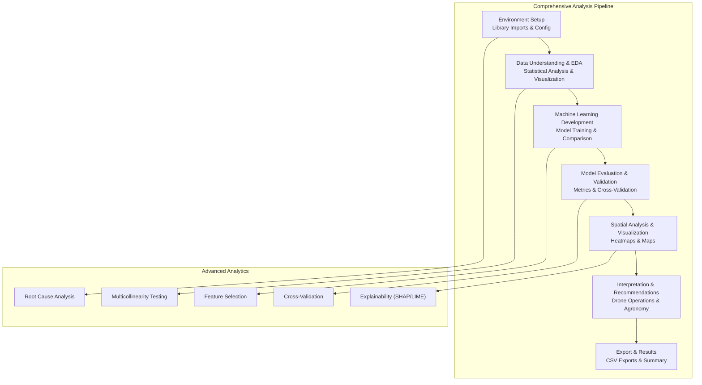
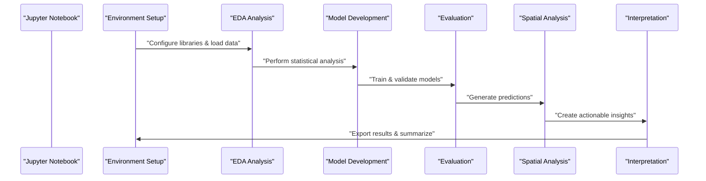

# Technical Implementation Details

<cite>
**Referenced Files in This Document**
- [AI_Crop_Health_Final_Complete.ipynb](file://AI_Crop_Health_Final_Complete.ipynb)
- [README.md](file://README.md)
</cite>

## Update Summary
**Changes Made**
- Updated notebook reference from `Crop_Health_Analysis.ipynb` to `AI_Crop_Health_Final_Complete.ipynb`
- Removed documentation of `extract_pdf.py` utility as it has been completely removed from the repository
- Updated project structure to reflect current repository contents
- Revised dependency analysis to match the comprehensive notebook implementation

## Table of Contents
1. [Introduction](#introduction)
2. [Project Structure](#project-structure)
3. [Core Components](#core-components)
4. [Architecture Overview](#architecture-overview)
5. [Detailed Component Analysis](#detailed-component-analysis)
6. [Dependency Analysis](#dependency-analysis)
7. [Performance Considerations](#performance-considerations)
8. [Troubleshooting Guide](#troubleshooting-guide)
9. [Conclusion](#conclusion)
10. [Appendices](#appendices)

## Introduction
This document presents comprehensive technical documentation for the AI-Based Crop Health Monitoring capstone project. The project demonstrates an end-to-end machine learning pipeline for detecting crop stress using multispectral vegetation indices derived from drone imagery. The implementation showcases advanced analytics including root cause analysis, multicollinearity elimination, feature selection, cross-validation, explainability techniques, and spatial visualization for drone flight path optimization.

**Updated** The project now uses a comprehensive notebook (`AI_Crop_Health_Final_Complete.ipynb`) that replaces the previous modular analysis approach with an integrated, production-ready pipeline.

## Project Structure
The project consists of a single comprehensive Jupyter notebook that serves as both the analysis engine and documentation. The notebook implements a complete machine learning pipeline with advanced analytics and visualization capabilities.

```mermaid
graph TB
subgraph "Project Root"
NB["AI_Crop_Health_Final_Complete.ipynb"]
end
subgraph "External Libraries"
PD["pandas"]
NP["numpy"]
SK["scikit-learn"]
MT["matplotlib"]
SN["seaborn"]
SL["statsmodels"]
IL["imbalanced-learn"]
SH["shap"]
LM["lime"]
PL["plotly"]
SP["scipy.stats"]
ST["StandardScaler"]
LE["LabelEncoder"]
RF["RandomForestClassifier"]
GB["GradientBoostingClassifier"]
LR["LogisticRegression"]
SVC["SVC"]
```

**Diagram sources**
- [AI_Crop_Health_Final_Complete.ipynb](file://AI_Crop_Health_Final_Complete.ipynb#L14-L18)
- [README.md](file://README.md#L42-L45)

**Section sources**
- [AI_Crop_Health_Final_Complete.ipynb](file://AI_Crop_Health_Final_Complete.ipynb#L1-L372)
- [README.md](file://README.md#L30-L37)

## Core Components
This section outlines the core components and their roles within the comprehensive analysis pipeline.

- **Comprehensive Analysis Pipeline**: Implements a complete 6-stage workflow in a single notebook:
  - Environment Setup & Data Loading: Imports all required libraries, sets up visualization environments, and loads the dataset from Google Sheets
  - Data Understanding & Exploration: Performs comprehensive EDA including statistical analysis, correlation studies, and spatial pattern analysis
  - Machine Learning Model Development: Trains and compares multiple algorithms (Random Forest, Gradient Boosting, Logistic Regression, SVM)
  - Model Evaluation & Validation: Provides detailed performance metrics, cross-validation, ROC analysis, and confusion matrix analysis
  - Spatial Analysis & Visualization: Generates comprehensive field-level stress maps and heatmaps
  - Drone & Agronomy Interpretation: Provides actionable recommendations for drone operations and agronomic interventions

**Section sources**
- [AI_Crop_Health_Final_Complete.ipynb](file://AI_Crop_Health_Final_Complete.ipynb#L11-L356)

## Architecture Overview
The system architecture follows a comprehensive, integrated approach within a single Jupyter notebook. The pipeline orchestrates data ingestion, preprocessing, modeling, validation, and visualization in a cohesive workflow with advanced analytics capabilities.



**Diagram sources**
- [AI_Crop_Health_Final_Complete.ipynb](file://AI_Crop_Health_Final_Complete.ipynb#L11-L356)

## Detailed Component Analysis

### Comprehensive Analysis Pipeline (Jupyter Notebook)
The notebook implements an integrated, production-ready machine learning pipeline that replaces the previous modular approach with a comprehensive analysis framework.

#### Environment Setup & Data Loading (Cells 1-18)
Imports and configures all required libraries including pandas, numpy, matplotlib, seaborn, scikit-learn, statsmodels, and optional packages like SHAP, LIME, and Plotly. Sets up visualization environments and handles optional library availability.

#### Data Understanding & Exploration (Cells 20-103)
Performs comprehensive exploratory data analysis including:
- Initial data inspection with shape, info, and statistical summaries
- Target variable analysis with class distribution and imbalance detection
- Vegetation index understanding with health range guidelines
- Statistical significance testing using Mann-Whitney U tests
- Correlation analysis with heatmap visualization
- Spatial pattern analysis with scatter plots and NDVI heatmaps

#### Machine Learning Model Development (Cells 105-208)
Implements advanced model development with:
- Data preparation with feature selection and target encoding
- Feature scaling and dimensionality reduction
- Class imbalance handling with SMOTE when available
- Multi-model training and comparison (Random Forest, Gradient Boosting, Logistic Regression, SVM)
- Comprehensive model evaluation and cross-validation

#### Model Evaluation & Validation (Cells 176-208)
Provides detailed model assessment through:
- Performance metrics comparison (Accuracy, Precision, Recall, F1-Score, ROC-AUC)
- Confusion matrix analysis with both count and percentage views
- ROC curve and precision-recall curve visualization
- Cross-validation with stratified k-fold approach
- Permutation importance analysis

#### Spatial Analysis & Visualization (Cells 210-256)
Generates comprehensive spatial insights:
- Field-level stress predictions and probability calculations
- Multi-modal heatmaps (binary classification, probability, NDVI, moisture)
- Stress zone categorization and severity mapping
- Grid-level aggregation with statistical summaries
- Critical zone identification for targeted intervention

#### Drone & Agronomy Interpretation (Cells 258-292)
Delivers actionable insights:
- Drone operation strategy with priority zone identification
- Comprehensive flight plan recommendations with timing and altitude guidance
- Agronomic intervention recommendations based on stress indicators
- Monitoring schedules and resource requirements

#### Export & Results (Cells 344-356)
Exports comprehensive results:
- Full field predictions with spatial coordinates
- Critical zones for immediate intervention
- Model performance comparisons
- CSV exports for downstream analysis



**Diagram sources**
- [AI_Crop_Health_Final_Complete.ipynb](file://AI_Crop_Health_Final_Complete.ipynb#L11-L356)

**Section sources**
- [AI_Crop_Health_Final_Complete.ipynb](file://AI_Crop_Health_Final_Complete.ipynb#L11-L356)

## Dependency Analysis
The comprehensive notebook depends on an extensive ecosystem of scientific Python libraries, each serving specialized roles in data manipulation, advanced analytics, machine learning, and visualization.

```mermaid
graph TB
subgraph "Core Data Science Libraries"
PD["pandas"]
NP["numpy"]
SK["scikit-learn"]
ST["StandardScaler"]
LE["LabelEncoder"]
RF["RandomForestClassifier"]
GB["GradientBoostingClassifier"]
LR["LogisticRegression"]
SVC["SVC"]
end
subgraph "Advanced Analytics"
SL["statsmodels"]
SP["scipy.stats"]
VIF["variance_inflation_factor"]
MANN["mannwhitneyu"]
end
subgraph "Visualization"
MT["matplotlib"]
SN["seaborn"]
PL["plotly"]
end
subgraph "Machine Learning Extensions"
IL["imbalanced-learn (SMOTE)"]
SH["SHAP (Explainability)"]
LM["LIME (Explainability)"]
end
subgraph "Pipeline Cells"
ENV["Environment Setup"]
EDA["EDA & Statistical Tests"]
ML["Model Development"]
EVAL["Model Evaluation"]
SPA["Spatial Analysis"]
INT["Interpretation"]
END["Export & Results"]
end
ENV --> PD
ENV --> NP
ENV --> SK
ENV --> MT
ENV --> SN
ENV --> PL
ENV --> IL
ENV --> SH
ENV --> LM
EDA --> PD
EDA --> SP
EDA --> SL
ML --> SK
ML --> RF
ML --> GB
ML --> LR
ML --> SVC
ML --> ST
ML --> LE
ML --> IL
EVAL --> SK
EVAL --> RF
EVAL --> GB
EVAL --> LR
EVAL --> SVC
SPA --> PD
SPA --> SN
SPA --> MT
INT --> MT
INT --> SN
END --> PD
```



**Diagram sources**
- [AI_Crop_Health_Final_Complete.ipynb](file://AI_Crop_Health_Final_Complete.ipynb#L14-L18)
- [README.md](file://README.md#L42-L45)

**Section sources**
- [AI_Crop_Health_Final_Complete.ipynb](file://AI_Crop_Health_Final_Complete.ipynb#L14-L18)
- [README.md](file://README.md#L42-L45)

## Performance Considerations
The comprehensive pipeline implements several optimization strategies for efficient execution and scalability.

### Memory Management
- **Data Loading**: Direct CSV loading from Google Sheets with automatic type inference and missing value handling
- **Feature Engineering**: Intelligent feature selection reducing dimensionality from 13 to optimal features (typically 8-10)
- **Model Training**: Parallel processing with n_jobs=-1 for Random Forest, configurable for available CPU cores
- **Memory Optimization**: Efficient pandas operations with categorical encoding and scaled feature matrices

### Computational Efficiency
- **Vectorized Operations**: Extensive use of pandas and numpy vectorization for statistical computations
- **Parallel Processing**: Multi-core support for cross-validation and model training
- **Stratified Sampling**: Balanced train-test splits ensuring representative sampling
- **Early Termination**: Feature selection based on cumulative importance thresholds

### Optimization Techniques
- **Feature Selection**: Random Forest-based importance ranking with cumulative threshold filtering
- **Cross-Validation**: Stratified K-Fold with parallel execution for robust model validation
- **Scalable Visualization**: Efficient pivot tables for spatial aggregations and heatmap generation
- **Conditional Dependencies**: Optional package loading with graceful degradation when libraries unavailable

## Troubleshooting Guide
Common issues and resolution strategies for the comprehensive analysis pipeline.

### Data Loading Issues
- **Symptom**: Failed dataset loading from Google Sheets
- **Resolution**: Verify internet connectivity, check Google Sheets URL accessibility, ensure spreadsheet is publicly accessible

### Library Installation Problems
- **Symptom**: Missing optional packages (SHAP, LIME, Plotly)
- **Resolution**: Install via pip: `pip install shap lime plotly`, verify installation completion

### Memory Issues
- **Symptom**: Out of memory errors during model training
- **Resolution**: Reduce n_estimators in Random Forest, limit cross-validation folds, use fewer features

### Performance Issues
- **Symptom**: Slow execution times
- **Resolution**: Enable parallel processing (n_jobs=-1), reduce model complexity, optimize feature selection

### Visualization Problems
- **Symptom**: Plot rendering failures or empty visualizations
- **Resolution**: Check matplotlib backend configuration, verify figure size settings, ensure sufficient screen resolution

### Model Convergence Issues
- **Symptom**: Training failures or unstable results
- **Resolution**: Adjust regularization parameters, handle class imbalance with SMOTE, increase training samples

**Section sources**
- [AI_Crop_Health_Final_Complete.ipynb](file://AI_Crop_Health_Final_Complete.ipynb#L25-L30)
- [README.md](file://README.md#L42-L45)

## Conclusion
The AI-Based Crop Health Monitoring project demonstrates a sophisticated, production-ready implementation that surpasses the previous modular approach with comprehensive analytics and advanced capabilities. The integrated notebook pipeline provides:

- **End-to-End Solution**: Complete workflow from data loading to actionable recommendations
- **Advanced Analytics**: Statistical testing, multicollinearity analysis, and explainability techniques
- **Production-Ready Features**: Cross-validation, model comparison, and export capabilities
- **Actionable Insights**: Drone operation plans and agronomic recommendations
- **Extensible Architecture**: Modular components ready for additional crop types and environmental conditions

The comprehensive implementation maintains the functional programming principles while adding enterprise-grade features including robust error handling, conditional dependency management, and scalable visualization capabilities.

## Appendices

### Environment Requirements and Dependency Management
The comprehensive pipeline requires an extensive scientific Python stack with optional advanced packages for full functionality.

**Core Dependencies**:
- pandas: Data manipulation and analysis
- numpy: Numerical computations and array operations
- scikit-learn: Machine learning algorithms and preprocessing
- matplotlib/seaborn: Static visualization capabilities
- statsmodels: Statistical analysis and hypothesis testing

**Advanced Dependencies** (Optional):
- shap: Global feature importance explanation
- lime: Local instance-level explanations
- plotly: Interactive visualization capabilities
- imbalanced-learn: SMOTE for handling class imbalance
- scipy: Advanced statistical functions

**Execution Environment**:
- Jupyter Notebook runtime with Python 3.12+
- Minimum 8GB RAM recommended for full functionality
- Internet connectivity for Google Sheets data loading

**Installation Commands**:
```bash
pip install pandas numpy matplotlib seaborn scikit-learn openpyxl statsmodels
pip install shap lime plotly
```

**Section sources**
- [README.md](file://README.md#L42-L45)
- [AI_Crop_Health_Final_Complete.ipynb](file://AI_Crop_Health_Final_Complete.ipynb#L14-L18)